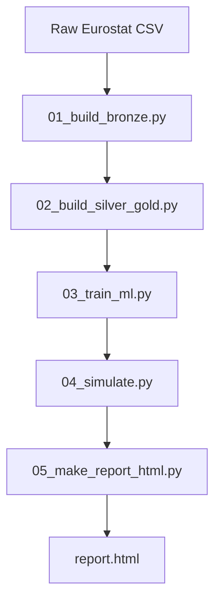

# 🇩🇪 Eurostat Cloud Adoption × Economic Performance (Germany)

## Overview

This project investigates the relationship between sector-level cloud adoption intensity and economic performance in Germany using Eurostat datasets.

It was developed as part of an MBA in Data Science & Analytics research project and structured following modern data engineering and machine learning best practices.

The repository implements a fully reproducible end-to-end pipeline:

Bronze → Silver → Gold → ML → Forecast → HTML Report

---

## 🎯 Research Objective

To evaluate whether cloud adoption intensity explains and predicts sector-level gross value added in Germany, and to simulate future economic scenarios (2026–2030).

The core research question:

> Can digital transformation intensity (cloud adoption) serve as a statistically robust explanatory variable for sector-level economic performance?

---

## 📊 Data Sources

- Eurostat – ICT usage in enterprises
- Eurostat – National Accounts (NAMA)
- Country focus: Germany (DE)

The datasets were harmonized at sector and year level.

---

## 🏗️ Architecture



---

## ⚙️ Pipeline Layers

### 🟤 Bronze
- Raw ingestion
- Country filtering (Germany)
- Schema alignment
- Initial integrity validation

### 🟡 Silver
- Data cleaning
- Feature engineering
- Cloud intensity harmonization
- Missing value handling

### 🟢 Gold
- Modeling dataset construction
- Target variable definition (sector-level value added)
- Final feature matrix for ML

---

## 🤖 Machine Learning Models

Two supervised regression models were evaluated:

- Linear Regression
- XGBoost Regressor

### Validation Strategy

- Time-based holdout split
- No data leakage
- Metrics:
  - RMSE
  - MAE
  - R²

---

## 📈 Holdout Results

The models achieved strong explanatory performance:

- R² ≈ 0.98–0.99
- Stable RMSE across sectors
- High alignment between actual and predicted values

This indicates strong statistical association between cloud intensity and economic value added at the sector level.

Full metrics available in:

```
output/ml_report.json
```

---

## 🔮 Forecast Simulation (2026–2030)

A forward simulation was implemented using projected cloud intensity growth scenarios.

For each sector:

- Cloud intensity was projected
- Model inference generated predicted value added
- Comparative scenario (Linear Regression vs Main model) available

Outputs:

```
output/forecast_2026_2030.csv
output/report.html
```

The HTML report includes:

- Holdout actual vs predicted visualization
- Forecast curves for top sectors
- Optional model comparison
- Dataset previews
- Full metric export

---

## 📂 Repository Structure

```
EUROSTAT_ML/
│
├── data/            # raw & sample data (large raw files ignored)
├── scripts/         # full pipeline implementation
├── output/          # generated artifacts & HTML report
├── .gitignore
├── requirements.txt
└── README.md
```

---

## ▶️ How to Reproduce

```bash
pip install -r requirements.txt
python scripts/run_all.py
```

This will:

1. Build Bronze layer
2. Transform to Silver & Gold
3. Train ML models
4. Generate forecasts
5. Produce the final HTML analytical report

---

## 📚 Methodological Notes

- Quantitative empirical research design
- Secondary public data (Eurostat)
- Sector-year panel modeling
- Supervised regression approach
- Forecast simulation based on projected feature growth

Limitations:

- No causal inference performed
- Single-country case study (Germany)
- Assumes projected cloud growth scenario validity

Future research could expand to:

- Multi-country comparison
- Panel regression models
- Causal econometric approaches
- Structural equation modeling

---

## 🧠 Technical Highlights

- Layered data architecture (Bronze/Silver/Gold)
- Reproducible ML pipeline
- Modular script structure
- Automatic HTML reporting
- Separation of training and forecasting logic
- Academic + production-grade repository structure

---

## 📌 Academic Context

This repository supports an academic research project investigating digital transformation impact on economic performance using reproducible machine learning pipelines.

The complete implementation (data processing, modeling, forecasting, reporting) is fully available in this repository.

---

## 👤 Author

Mauricio Esquivel  
Data Engineer | Cloud & Analytics  
MBA in Data Science & Analytics  

---

## 📎 Citation (for academic reference)

The full reproducible implementation is available at:

https://github.com/Mauricio1806/eurostat_ml
