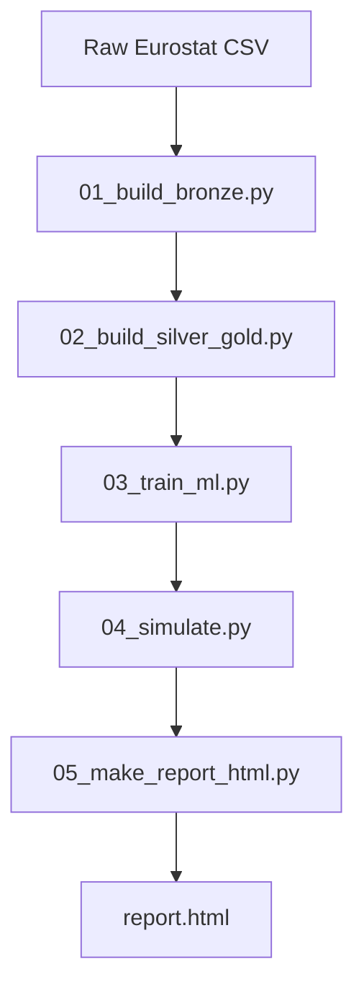

# 🇩🇪 Eurostat Cloud Adoption × Economic Performance (Germany)

## Overview
This project analyzes the relationship between cloud computing adoption and sector-level economic performance in Germany using real Eurostat datasets.

It was developed as part of an MBA in Data Science & Analytics and structured following modern data engineering and machine learning best practices.

The repository implements a fully reproducible end-to-end pipeline:

Bronze → Silver → Gold → ML → Forecast → HTML Report

---

## 🎯 Research Objective
To evaluate whether cloud adoption intensity explains and predicts sector-level gross value added in Germany.

Core research question:
Can digital transformation intensity (cloud adoption) serve as a statistically robust explanatory variable for economic performance?

---

## 📊 Data Sources
- Eurostat — ICT usage in enterprises (isoc_cicce_usen2)
- Eurostat — National Accounts (nama_10_a64)

Scope:
- Country: Germany (DE)
- Period: 2010–2024

The datasets were harmonized at sector and year level.

---

## 🏗️ Architecture

---

## ⚙️ Pipeline Layers

### 🟤 Bronze
- Raw data ingestion from Eurostat (CSV)
- Filtering for Germany
- Schema alignment
- Storage in Parquet format

Outputs:
- bronze_gva_de.parquet
- bronze_cloud_de.parquet

---

### 🟡 Silver
- Data cleaning and standardization
- Type conversion
- Missing value handling
- Structuring by sector and year

Outputs:
- silver_gva.parquet
- silver_cloud.parquet

---

### 🟢 Gold
- Integration of economic and cloud datasets
- Feature engineering
- Final analytical dataset for modeling

Main variables:
- sector
- year
- value_added_clv05_meur
- cloud_e_cc_pc_ent
- cloud_intensity
- cloud_intensity_sector
- sector_weight
- target_value_added

Outputs:
- gold_model_dataset.parquet
- gold_model_dataset.csv

---

## 🧠 Feature Engineering

- cloud_intensity = cloud_e_cc_pc_ent
- cloud_intensity_sector = sector average
- sector_weight = sector share of total value added

Missing values:
- Global median → cloud_intensity
- Sector median → cloud_intensity_sector

---

## 🤖 Machine Learning

### Linear Regression
Baseline econometric model:
y = β0 + β1x1 + ... + βnxn + ε

### Gradient Boosting (XGBoost)
- Tree-based ensemble model
- Sequential learning
- Regularized optimization

---

## 📏 Validation Strategy

Time-based split (holdout):
- Train: 2010–2021
- Test: 2022–2024

Metrics:
- RMSE
- MAE
- R²

---

## 📈 Results

### Linear Regression
- RMSE ≈ 9191
- MAE ≈ 6182
- R² ≈ 0.993

### Gradient Boosting
- RMSE ≈ 13010
- MAE ≈ 7175
- R² ≈ 0.987

### Key Insight
Both models present strong explanatory power.

The linear model outperformed the ML model on aggregated data, indicating a strong and stable relationship between cloud adoption and economic performance.

---

## 🔮 Forecast (2026–2030)

Simulation based on cloud adoption growth:

cloud_intensity(t+1) = cloud_intensity(t) × (1 + growth_rate)

Predictions:
ŷ = model.predict(X)

Outputs:
- forecast_2026_2030.csv
- forecast_2026_2030_lr.csv

---

## 📊 Generated Outputs

- ml_report.json
- predictions_holdout.csv
- forecast_2026_2030.csv
- forecast_2026_2030_lr.csv
- report.html

---

## 📊 Visualizations

- Actual vs Predicted (holdout)
- Forecast by sector (2026–2030)
- Model comparison
- Sector deep-dive (B–E)

---

## 🌐 Live Report

👉 file:///C:/Users/mauri/Videos/data-engineering-workspace.code-workspace/eurostat_ml/output/report.html

(Interactive HTML report with full analysis, forecasts and model results)

---

## 📂 Repository Structure

EUROSTAT_ML/
├── data/
├── scripts/
├── output/
├── requirements.txt
└── README.md

---

## ▶️ How to Reproduce

pip install -r requirements.txt  
python scripts/run_all.py  

This will:
- Build Bronze layer
- Generate Silver and Gold datasets
- Train models
- Generate forecasts
- Produce HTML report

---

## 🧪 Methodological Notes

- Quantitative empirical research
- Public Eurostat data
- Sector-year panel structure
- Supervised regression
- Forecast simulation via feature projection

Limitations:
- No causal inference
- Single-country analysis
- Forecast depends on assumed growth rates

---

## 🚀 Technical Highlights

- End-to-end Medallion architecture
- Reproducible ML pipeline
- Modular scripts
- Automated HTML reporting
- Separation of ingestion, modeling and forecasting

---

## 📌 Why This Project Matters

This project connects:
- Data Engineering
- Machine Learning
- Economic analysis

Using real-world data in a production-style pipeline.

---

## 👤 Author

Mauricio Esquivel  
Data Engineer | Cloud & Analytics  
MBA in Data Science & Analytics  

---

## 📎 Repository

https://github.com/Mauricio1806
